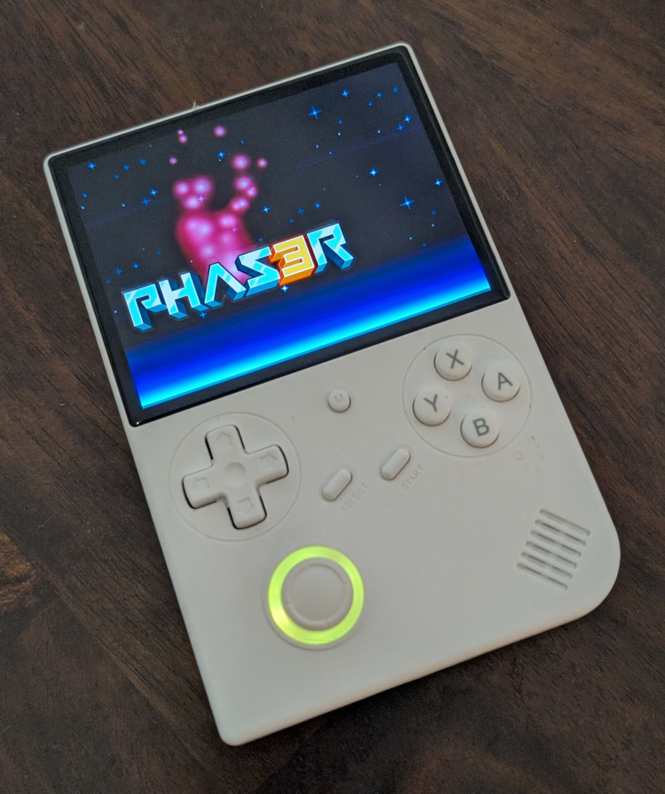

# Media

### Redit posts by monteslu that got a several people interested.

https://www.reddit.com/r/ANBERNIC/comments/1hsyv9n/something_fun_to_hack_on_this_weekend/

https://www.reddit.com/r/ANBERNIC/comments/1htp3bk/knocked_out_a_couple_of_quick_javascript_games/

### Youtube

A video of the project in action by [joyrider3774](twitter.com/joyrider3774)
https://www.youtube.com/watch?v=vjBS4O0DVlk

Intro/Tutorial video by [@monteslu](https://bsky.app/profile/monteslu.com) https://www.youtube.com/watch?v=osJsBRPSrM4

### Blue Sky

January 4, 2025 "Quick JS Games" https://bsky.app/profile/monteslu.com/post/3lex24dz3ws2c

January 3, 2025 "Weekend Fun" https://bsky.app/profile/monteslu.com/post/3leum44ni622b

December 20, 2024 "Nodered demo" https://bsky.app/profile/monteslu.com/post/3ldrle6x3us26

December 11, 2024 "Halfstack . . . the real reason" https://bsky.app/profile/monteslu.com/post/3ld2g3bpank23

January 17, 2025 8 cores on a retroid pocket 5
https://bsky.app/profile/monteslu.com/post/3lfxk3k57s22g

### Images

