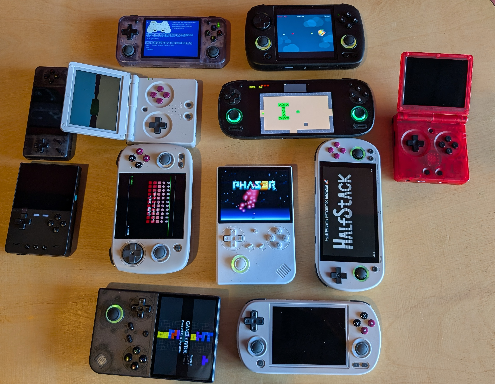

# JavaScript Game Launcher
Hello, I'm Aziza! This is a a seperate branch I have creathed to dive into this project from Halfstack Conferance 25' in Phoenix, AZ

A compatibly layer for JavaScript games to run WITHOUT a browser or electron using standard web APIs.

The goal is to run games on cheap ($50) retro devices (or even not so cheap ones as long as they run Linux . . . for now!) that will also run in browsers without any changes.

Right now we have support for anything that runs [Knulli](https://knulli.org/) and has wifi (so Ambernic XX devices and TrimUI Smart Pro) as well as [Batocera](https://batocera.org/) (which can just be a old PC, a Raspberry Pi, or a ton of other handheld devices) or [ROCKNIX](https://rocknix.org/) which has a long list of supported devices. We also have it running in [RetroBat](https://www.retrobat.org/) which is Batocera for Windows. It can be easily added to anything running Emulation Station using the instructions below but that's just the beginning.

### Browser APIs progress

- [x] Canvas (2d)
- [x] WebAudio
- [x] Keyboard events
- [x] Gamepad API
- [x] FontFace 
- [x] LocalStorage
- [x] Web Assembly (WASM)
- [x] Web Workers
- [x] WebSockets
- [ ] Peer Connection
- [ ] WebGL (Canvas 3D)

## JS Game Engine support

- [Phaser](https://phaser.io/)

3D effects are not supported, but you can use the canvas API to draw 3D graphics.

Other engines might work we just haven't tried them!

## Sample games

[Sample games / Demos / Starter projects](https://github.com/monteslu/jsgames)

## Running on a desktop OS (Mac, Linux, even Windows!)

### Quickstart
 - use node 22, change to a game directory
 - Make a game.js file and a gamename.jsg file
 - `npx rungame -rom ./gamename.jsg`

### For contributors!
- use at least node 22
- clone this repo, cd to this directory
- npm install
- `node index -rom /full/path/to/game.js` (clone sample game at https://github.com/monteslu/jsgames/tree/main/tuxgame or find other games at https://github.com/monteslu/jsgames)

### Use the web
You can also just run the game directly without using jsgamelauncher. The goal is to make web games that also work on a low end device but the web is a first class citizen. Check out the [Simple Vite](https://github.com/monteslu/jsgames/tree/main/simple-vite) example. Most examples will run on the web with `npm run dev`.

## Notes on Installing to a device

For now we only support downloading the latest version of jsgamelaucher. At some point we might modify the download script to accommodate downloading specific published versions. Same goes for the different firmware versions you see below . . . generally you will need the latest.

## Installing on [Knulli](https://knulli.org/) or [Batocera](https://batocera.org/)

### Use the install script [(src)](https://github.com/monteslu/jsgamelauncher/blob/main/installers/install-batocera-knulli.sh)!

- Make sure wifi is turned on for your Knulli device or you are otherwise connected to the internet on a Batocera device
- `ssh root@<myDevice>` (default password: linux, default device name : KNULLI or BATOCERA, use IP from device or <myDevice>.local if name fails)
- `curl -o- https://raw.githubusercontent.com/monteslu/jsgamelauncher/main/installers/install-batocera-knulli.sh | bash`
- That's it! Update the games list! Now you need a [game](https://github.com/monteslu/jsgames)! Just put that in `/userdata/roms/jsgames` if you are using the default setup. All you need is a `game.js` file as a starting point and a file called "&lt;game name&gt;.jsg". This could change!

## Installing on [ROCKNIX](https://rocknix.org/)

### Use the install script [(src)](https://github.com/monteslu/jsgamelauncher/blob/main/installers/install-rocknix.sh)!

- Make sure wifi is turned on and connected to the internet
- Make sure you enable ssh on your device
- `ssh root@<myDevice>` (default password: rocknix, default device name depends on the device, for the retroid pocket 5 it was `SD865` (which is the name of the chipset). You can also just ssh `root@<IP>`.
- `curl -o- https://raw.githubusercontent.com/monteslu/jsgamelauncher/main/installers/install-rocknix.sh | bash`
- That's it! Update the games list! Now you need a [game](https://github.com/monteslu/jsgames)! Just put that in `/roms/jsgames`. All you need is a game.js file as a starting point and a file called "&lt;game name&gt;.jsg". This could change!

## Installing on [RetroBat](https://www.retrobat.org/)

Installer script coming soon! The config files you need are in systems/retrobat and for now you can manually copy them to the correct location.

 - jsgamelaucher folder => `C:\RetroBat\emulators\jsgamelauncher\`
 - systems/retrobat/es_systems_jsgames.cfg => `C:\RetroBat\emulationstation\.emulationstation\`
 - games => `C:\RetroBat\roms\jsgames\` [Sample Games Here](https://github.com/monteslu/jsgames)
 - Then go to the EmulationStation Game Settings menu and choose "Update Gamelists"

## Installing on [muOS](https://muos.dev/)

Coming soon! According to [joyrider3774](https://www.reddit.com/user/joyrider3774/) on this [thread](https://www.reddit.com/r/ANBERNIC/comments/1hsyv9n/comment/m5e2zsy/?context=3) all we need to do is install the GNU versions of ls and tar so that the curl command for installing nvm works.

## The long way (leaving this here for reference for other systems)

- Make sure wifi is turned on for your Knulli device
- `ssh root@<myKnullidevice>` (default password: linux, default device name : KNULLI, use IP from device if name fails)
- `touch ~/.bash_profile`
- `curl -o- https://raw.githubusercontent.com/nvm-sh/nvm/v0.40.0/install.sh | bash`
- `source ./.bash_profile`
- `nvm install 22`
- If you did npm install in jsgamelauncher on your local machine, delete the node_modules directory
- Copy this directory (jsgamelauncher) to `/userdata/system` on the knulli device (using the SMB share at \\<myKnullidevice>\share\system, or SFTP, etc)
- `chmod +x ~/jsgamelauncher/systems/knulli/run.sh`
- `cp ~/jsgamelauncher/systems/knulli/es_systems_jsgames.cfg ~/configs/emulationstation/`
- `mkdir /userdata/roms/jsgames`
- `cd ~/jsgamelauncher`
- `npm install`
- Copy any "roms" to jsgames (can do this with samba, ftp, or onto the SD card, note that if you connected via Samba, you might have to force a refresh of the Samba share)
- Restart the system
- ENJOY!

## Media

Check the [MEDIA.md](MEDIA.md) for a running list of places this project has been posted. Not a comprehensive list of course but it helps us keep track for sharing in the future. If you see anything you liked that missing let us know . . . we might have missed it.
