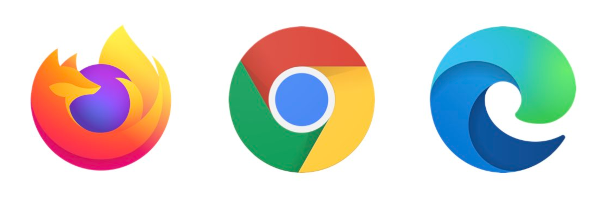

# Developing Games for jsgamelauncher


## Getting Started

To develop games that work seamlessly with jsgamelauncher, just develop your game for the browser!



- [Prerequisites](#prerequisites)
- [Set up options for your game project folder](#set-up-options-for-your-game-project-folder)
- [Important files](#important-files)
- [Running Your Game](#running-your-game)
- [Dependencies](#dependencies)
- [Basic game loop without a game engine](#basic-game-loop-without-a-game-engine)
- [Using the Gamepad API](#using-the-gamepad-api)
- [Reading Input without a gamepad](#reading-input-without-a-gamepad)
- [Debugging](#debugging)
- [Examples](#examples)
- [AI based quick start](#ai-based-quick-start)


## Prerequisites

- Install [**Node.js**](https://nodejs.org/en/download)
- Use a text editor such as [**VSCode**](https://code.visualstudio.com/) or [**Cursor**](https://www.cursor.com/) or whatever you are comfortable with.

## Set up options for your game project folder

- Use the [simple-jsgame-starter](https://github.com/monteslu/simple-jsgame-starter) to get started quickly.

- Use can use a tool like [**Vite**](https://vitejs.dev/) to scaffold up your game project.


  from a command line, run and give it a game name:
  ```sh
  npm create vite@latest
  ```
  Vanilla JavaScript works great, but typescript is also supported.


- Use a plain old HTML file, package.json and a js file.

- Use another javascript game engine's starter project.


## important files

- index.html

  make sure to include a canvas element in your html file.
  ```html
  <canvas id="game-canvas" height="480" width="640"></canvas>
  ```

- main.js or game.js or whatever you want to call it.

  If you used vite, this will be the default entry point and is already set up in the `src` folder.

- package.json

  We recommend specifying the following in your package.json:
  ```json
  "type": "module",
  ```

- &lt;my-game-name&gt;.jsg file

  This is a configuration file for jsgamelauncher.
  It is an optional empty file, but recommended to have it for your game to be recognized by EmulationStation on a retro gaming device.  Name it the same as your game.

## Running Your Game

- With vite

  ```sh
  npm run dev
  ```
  Open your browser and navigate to the url it gives you.


- Without a browser

    ```sh
    npx rungame ./mygame.jsg
    ```


## Dependencies

You can use most libraries that are browser compatible. Including many javascirpt game engines.

`npm install somelibrary`

## Basic game loop without a game engine

your javascript file should have a function that is called every frame.
```js
const canvas = document.getElementById("game-canvas");
const ctx = canvas.getContext("2d");

let lastTime = performance.now();

function update(deltaTime) {
  // check for gameapd input
  // update game logic
  // play sound effects
}

function render() {
  // clear the canvas
  ctx.clearRect(0, 0, canvas.width, canvas.height);
  // draw the game
}

function gameLoop(time) {
  const deltaTime = performance.now() - lastTime;
  update(deltaTime);
  lastTime = time;
  requestAnimationFrame(gameLoop);
}

// start the game loop
gameLoop();
```


## Using the Gamepad API

Retro gaming devices typically do not have a keyboard and mouse, so the [gamepad api](https://developer.mozilla.org/en-US/docs/Web/API/Gamepad_API) is a great way to allow players to control your game.

It's as simple as plugging in a gamepad to your computer and using:

```js
  // get array of all gamepads
  const gamepads = navigator.getGamepads();
  // check if the first gamepad is connected
  if (gamepads[0]) {
    let pad = gamepads[0];
    if (pad.buttons[0].pressed) {
      console.log("Button A pressed");
    }
  }
```

to test out a gamepad and see how the buttons are mapped, you can use the following website:

[Gamepad Tester](https://gamepads.netlify.app/)


## Reading Input without a gamepad

For local development without a gamepad you can use a keyboard abstraction such as [utils.js](https://github.com/monteslu/simple-jsgame-starter/blob/main/src/utils.js)

```js
import { getInput } from "./utils.js";

function update() {
  const [gamepad1] = getInput();

  // arrow keys if no gamepad is connected
  if (gamepad1.DPAD_UP.pressed) {
    console.log("DPAD_UP");
  }

  // Z key if no gamepad is connected
  if (gamepad1.BUTTON_SOUTH.pressed) {
    // South button is B on nintendo controllers, A on xbox controllers
    console.log("South Button pressed");
  }
}
```

## Debugging

- Debugging games in browser is as simple as using the browser's [developer tools](https://developer.mozilla.org/en-US/docs/Learn/Common_questions/What_are_browser_developer_tools).

- In the jsgamelauncher you can use the `--inspect` flag and use node inspector to debug your game.

## Examples

For example games and demos compatible with jsgamelauncher, check out the [jsgames repository](https://github.com/monteslu/jsgames).

## AI based quick start
- Clone the [simple-jsgame-starter](https://github.com/monteslu/simple-jsgame-starter)
- Run `npm install`
- Run `npm run dev`
- Open your browser and navigate to the url it gives you.
- Prompt your AI with the `src/main.js`, `src/utils.js` and `index.html` file and describe the game you want to make.
- The AI will update the javascript files with the code you need to make the game.
- Play your new game!


Contributions and feedback are welcome!

